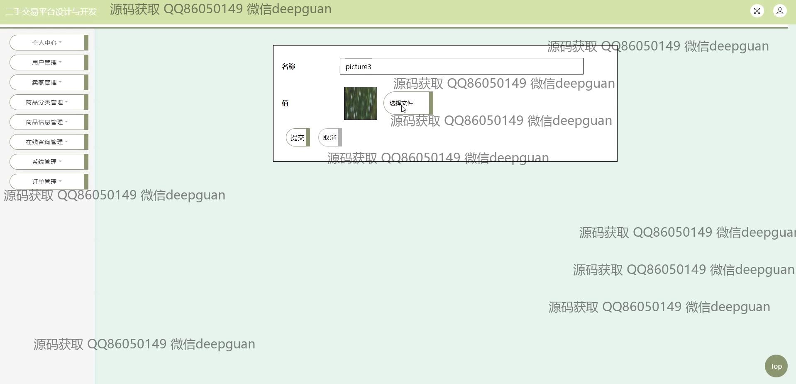
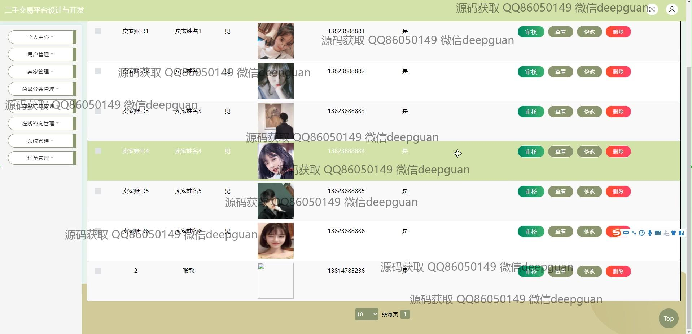

<h1 align="center">基于SSM的二手交易平台设计与开发+jsp</h1>

## 简介
二手交易平台：角色分为管理员、用户、卖家；功能包括商品管理、用户注册与登录、个人中心管理、在线咨询、订单管理、收藏管理、购物车功能，提供简洁友好的用户界面和高效的系统交互。    --计算机毕业设计源码；毕设源码；java毕业设计源码

## 联系方式

<h3 align="center">获取完整代码与数据库文件 + 微信：deepguan QQ: 86050149 QQ群: 783742310</h3>

<h3 align="center">可帮忙远程部署 包运行成功！提供远程部署、修改代码、设计文档指导、代码讲解等服务！</h3>

## 功能介绍（完整见运行截图）
管理员：登录界面提供账号和密码输入功能，可区分身份类型，实施身份审核和管理功能，如用户和卖家信息管理。商品信息管理模块允许查看、修改、删除商品，并提供审批流程。订单管理和在线咨询管理用于维持平台运营。支持系统公告发布和内容编辑，确保信息传达准确。个人中心可管理管理员资料和查看系统操作日志。通过购物车模块，可模拟交易与订单追踪。

用户：提供用户注册、登录、个人信息管理功能，通过首页导航访问商品信息及购物模块。商品模块涵盖搜索、浏览商品详情、添加购物车以及在线咨询功能，方便用户进行比价和信息沟通。个人中心支持订单查询、收货地址管理和个人收藏管理功能，提升用户购物体验。在线咨询模块提供实时问题反馈，实现与卖家的直接互动。

卖家：支持卖家注册，完成后进行商品信息录入与管理，包括商品名称、分类、品牌、价格等属性设置，支持图片上传和库存管理。卖家个人中心提供账户信息管理和订单处理功能，便于及时处理买家需求。通过系统公告和咨询反馈模块，卖家能够获知平台动态及买家咨询并作出响应。此外，收藏管理模块帮助卖家了解商品受欢迎程度。

## 运行截图

本代码来源于网络,仅供学习参考使用!

